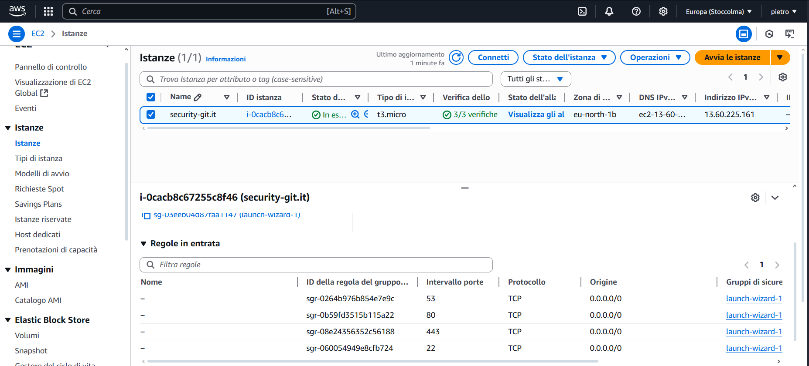

# Email spoofing and phishing Attack - Technical report

## Overview
Simulated phishing attack using a fake login page (phishlet) to steal user's credentials and cookies to bypass 2FA for GitHub.

## Technical Configuration
- **Tools used**:
  - Lookalike domain "security-git.it" registered via Register.it 
  - Amazon Linux EC2 instance (AWS t2.micro)
  - Evilginx2 MITM phishing framework
  - Email campaign using Zoho Mail

- **Threat Model**:
  - Attacker knows target's mail address and knows he has a GitHub profile      
  

## Attack Flow
1. Domain Registration and Configuration.

I have registered via Register.it the lookalike domain "security-git.it". In the DNS  management panel of Register.it, I added all the necessary records:
Main A record:

security-git.it → points to the public IP of the AWS instance (e.g. 13.60.225.161).

api.security-git.com → same IP (13.60.225.161).

github.security-git.it → same IP (13.60.225.161).

These subdomains are proper of the phishlet itself as they will be used to present the fake GitHub login page.
MX record:

Configured to allow e-mails to be sent and received via the chosen service (Zoho SMTP), thus enabling the address noreply@security-git.it to send phishing e-mails.

2. Provisioning the AWS instance (Amazon Linux)

I purchased a new EC2 instance on AWS, selecting Amazon Linux 2023 as the operating system.
I assigned 'security-git.it' as the instance name to facilitate internal traceability.
I chose the t2.micro type (included in the AWS Free Tier) to reduce costs while maintaining sufficient computing power for the phishing attack. Moreover, I downloaded the .pem file containing the keypair to authenticate through SSH to the service. I have modified the inbound rules of the Security Group for the cloud service, opening the following ports: 
  - port 22 (SSH, TCP) - source IP 0.0.0.0/0
  - port 80 (HTTP, TCP) - source IP 0.0.0.0/0
  - port 443 (HTTPS, TCP) - source IP 0.0.0.0/0
  - port 53 (DNS, TCP) - source IP 0.0.0.0/0

The opening of these protocols allows both remote access to the machine (SSH) and the provision of web pages (HTTP/HTTPS), as well as possible DNS services.
After that, I copied the public IPv4 (13.60.225.161) and placed it in the A records of the domain on Register.it, so that security-git.it and all subdomains would resolve to that address.

3. Accessing and setting up the environment on the Amazon Linux machine - Connection via SSH

From Windows Command Prompt I used OpenSSH to connect to the service with the command
`ssh -i C:\Users\terse\Downloads\keys.pem ec2-user@13.60.225.161`
After accepting the server fingerprint, I found myself in the ec2-user prompt on the Amazon Linux instance. Since tools like Evilginx need Go for compilation, I have installed it with
 `sudo yum update -y`
`sudo yum install golang -y`.

After that I had to clone the git repository of the Evilginx framework and I downloaded in the `/phishlets` directory the raw for the github.yaml file (the actual phishlet) from GitHub official repository.

4. Configuration of Evilginx2 and generation of the phishing link

After having prepared everything, I started Evilginx2 using the command `sudo ./bin/evilginx -p phishlets/` from evilginx2's directory:

Within the Evilginx2 interactive console I executed these commands:
  -  `config domain security-git.it` : sets the main domain that will be used to serve phishlets and as the basis for TLS/DNS records.
  -  `config ipv4 13.60.225.161` : communicates to Evilginx2 the IPv4 of the EC2 instance on which the proxy runs.
  -  `phishlets hostname github security-git.it` : defines the specific domain name for the GitHub phishlet (i.e. github.security-git.it) and associates it with the phishlet called 'github'. Evilginx2 automatically generates internal routing and internal DNS resolution rules so that all requests to github.security-git.it are handled by this phishlet.
  -  `phishlets enable github` : actually enables the 'github' phishlet (previously copied to the /evilginx2/phishlets/ folder).  Evilginx2 creates network listeners on port 80/443 linked to the GitHub phishing logic. In practice, the proxy starts responding to HTTPS requests directed to github.security-git.it by serving the fake GitHub login page.
  -  `lures create github` : generates a lure associated to the GitHub phishlet. A unique ID is allocated for that lure, which we can then use to construct the final phishing URL.
  - `lures get-url <ID>` : returns the complete phishing URL associated with that newly created lure. I.E : https://security-git.it/YPGJMnll

6. Preparing and sending the phishing e-mail - Configuring the e-mail sender on Zoho Mail

I created an e-mail account on Zoho with an address: noreply@security-git.it. 

Within Zoho and Register.it, I configured the DNS MX and SPF/DKIM records to allow Zoho to send 'authenticated' e-mails in the name of security-git.it. This ensures that the e-mail is not marked as spam and that the sender is trustworthy.

I composed an e-mail simulating an official security notice from GitHub, inviting the recipient to 'verify' or 'update' their credentials by clicking on the attached link, which is the phishing link. From the mail client I sent the e-mail (from noreply@security-git.it) to the target address.
The e-mail was flagged as 'legitimate' and did not end up in the spam folder of target's mail service.

Once target receives the mail and clicks on the phishing link, the browser sends the request to security-git.it/login, which resolves to IP 13.60.225.161 (my EC2 server acting like a MiTM/proxy), as if it was the real login page of GitHub.

As soon as the target submits the credentials, Evilginx2 captures it in real time (username/password) and simultaneously forwards it to the GitHub servers to complete the authentication.

Since many GitHub accounts have 2FA, after entering the credentials, the target is redirected to the 2FA code request.
The target enters its 2FA code (SMS, Authenticator app, etc.) and, once again, Evilginx2 captures that value and forwards it to the real GitHub server, completing the target's 'legitimate' login on GitHub servers.

After authentication is complete, the target's browser receives the session cookies from GitHub.

As a reverse proxy, Evilginx2 copies all session cookies and stores them locally.

In this way, the attacker can read the session cookies by typing `sessions <ID>` on Evilginx2 shell: he can then reproduce the login state by updating his own browser cookies (e.g. via the Cookie-Editor extension), thus bypassing the 2FA and accessing the target's account without needing to know the user/pass or OTP code.

## Conclusions
With this attack, after obtaining not only the victim's username and password, but also the session cookies needed to bypass the 2FA, the attacker could freely browse private repositories, download or delete code, create personal access tokens, and even send himself notifications or messages pretending to be the victim, all without being asked for a second authentication factor again. 
## Mitigations
To mitigate this type of risk, the user should first pay close attention to the URL and always check that the domain matches exactly the official one. The adoption of a 'phishing-resistant' two-factor authentication method (e.g. FIDO U2F/WebAuthn hardware keys) ensures that even when presenting a forged HTTPS certificate, the security device will refuse access. Furthermore, it is advisable to use unique passwords to avoid credential overlap and any other kind of credential stuffing attacks.

## Bibliography
  - Youtube: https://www.youtube.com/watch?v=sZ22YulJwao&t=1013s
  - Youtube: https://youtu.be/nre4qiYWrdY?si=NF6lunERX0Tc9aTd
  - Youtube: https://youtu.be/e7SebbYUS2w?si=YkJ1a_YLUesK5CAg
  - Youtube: https://youtu.be/AsnaqTCA95o?si=XkKrnXWhGbWt3QuE
  - Domain e-mail hosting setup: https://www.zoho.com/mail/help/adminconsole/email-hosting-setup.html
  - Evilginx documentation: https://help.evilginx.com
  - Evilginx documentation: https://breakdev.org/evilginx-2-1-the-first-post-release-update/
  - LetsEncrypt documentation: https://letsencrypt.org/docs/challenge-types/#:~:text=This%20is%20the%20most%20common,If%20the
  - C. Battaile, "Bypassing MFA: A Forensic Look at Evilginx2 Phishing Kit" : https://www.aon.com/cyber-solutions/aon_cyber_labs/bypassing-mfa-a-forensic-look-at-evilginx2-phishing-kit/#:~:text=activity%20–%20Evilginx2%20requests%20an,this%20page%20apart%20from%20a
  - Domain configuration for Evilginx informations: https://github.com/kgretzky/evilginx2/wiki/FAQ
  - Tool to check spf,dmarc,dkim of a domain: https://mxtoolbox.com/emailhealth/security-git.it/

